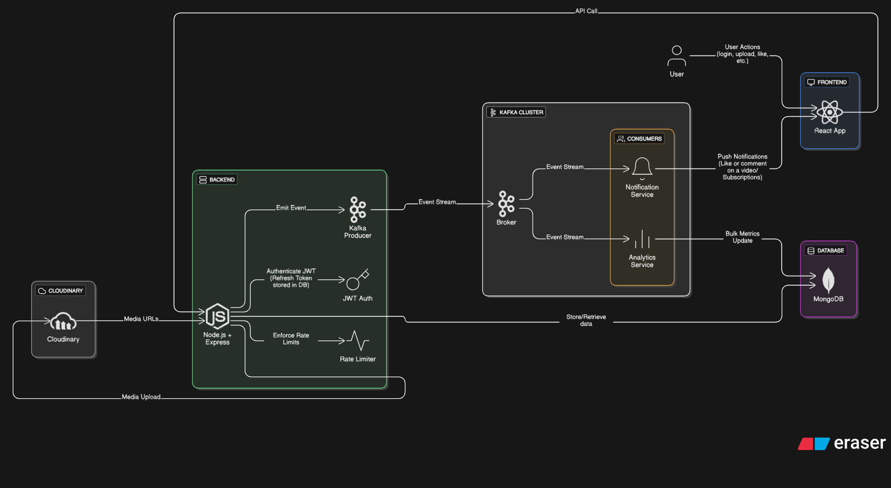

# FynVid

<p align="center">
  
</p>

FynVid is a full-stack video streaming platform inspired by YouTube, built using the **MERN** stack with **Kafka** integration for scalability and asynchronous processing.

---

## Tech Stack

### Frontend

- **React.js** for a fast, modern UI
- **Tailwind CSS** for styling
- **React Router** for navigation
- **Context API** for authentication & state management

### Backend

- **Node.js** + **Express.js** for RESTful APIs
- **MongoDB (Mongoose)** for database management
- **Kafka** for event-driven processing
- **JWT** for secure authentication

---

## System Architecture

<p align="center">
  
</p>

## Features

### User System

- Register and login securely using JWT
- Update profile info, avatar, and cover image

### Video Management

- Upload and manage videos
- Like, comment, and view videos
- Each **view event** is processed asynchronously via Kafka for scalability

### Playlists

- Create, update, and delete playlists
- Add or remove videos from playlists

### Likes & Comments

- Real-time updates on likes and comments
- **Kafka producers** trigger notification events when users interact with videos

### Notifications

- Get notified when:
  - Someone likes your video
  - Someone comments on your video
  - Someone subscribes to your channel
- **Kafka consumers** handle these events and create notifications efficiently

### Subscriptions

- Subscribe/unsubscribe to channels
- View content from subscribed creators

### Dashboard

- Track uploaded videos and performance metrics

---

## Kafka Integration

FynVid uses **Kafka** to decouple event generation from processing, ensuring scalability and responsiveness.

### Why We Use Kafka

- **Scalability:** Handles a massive number of concurrent events (likes, comments, views).
- **Decoupling:** Producers don’t wait for consumers, improving response time.
- **Reliability:** Prevents data loss even if a service temporarily fails.
- **Extensibility:** New services can easily subscribe to the same event streams.

### Kafka Consumers in FynVid

| Consumer                  | Role                                                      |
| ------------------------- | --------------------------------------------------------- |
| **Video Views Consumer**  | Processes and updates view counts in bulk for scalability |
| **Likes Consumer**        | Listens to like events and creates notifications          |
| **Comments Consumer**     | Listens to comment events and creates notifications       |
| **Subscription Consumer** | Handles subscriber events and generates notifications     |

> Except for **video views**, the Kafka consumers primarily handle **notification creation**, while the database insertions for likes, comments, and subscriptions happen directly in the controller.

---

## Docker Setup

You can quickly start **Kafka**, **Zookeeper**, and **Kafka UI** using Docker Compose.

```bash
docker-compose up -d
```

This will start:

- ⚙️ **Kafka Broker** at port **9092**
- 📊 **Kafka UI** at port **8089**

You can access the Kafka UI at **http://localhost:8089**

---

## Manual Setup (Optional)

### Clone the repository

```bash
git clone https://github.com/Vedantspit/FynVid.git
cd FynVid
```

### Setup backend

```bash
cd backend
npm install
```

### Setup frontend

```bash
cd frontend
npm install
```

### Environment variables

Create a `.env` file inside the **backend** directory with:

```
MONGO_URL=your_mongo_connection_string
CORS_ORIGIN=frontend_URL
ACCESS_TOKEN_SECRET=your_secret_key
ACCESS_TOKEN_EXPIRY=duration
REFRESH_TOKEN_SECRET=your_secret_key
REFRESH_TOKEN_EXPIRY=duration
CLOUD_NAME=cloudinary_cloud_name
CLOUD_KEY=cloudinary_cloud_key
CLOUD_SECRET=i-cloudinary_secret
```

### Start backend

```bash
npm run dev
```

### Run frontend

```bash
npm run dev
```

---

## Architecture Overview

```text
Frontend (React)
      ↓
Express API (Node.js)
      ↓
MongoDB (Data Storage)
      ↓
Kafka (Event Queue)
      ↓
Consumers (Async Processing)
```
